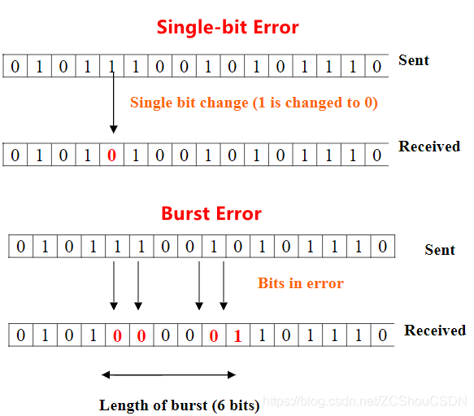

<!-- （奇偶校验VRC、LRC、CRC 原理、校验和、）详解 -->
<!--page header-->

## 数据校验

  数据在传输的过程中，会受到各种干扰的影响，如脉冲干扰，随机噪声干扰和人为干扰等，这会使数据产生差错。为了能够控制传输过程的差错，通信系统必须采用有效措施来控制差错的产生，并保证数据的完整性。

如下所示的传输错误



### 奇偶校验

> [!TIP]
> 奇偶校验别名垂直冗余检查或横向冗余校验(VRC, Vertical Redundancy Check/TransverseRedundancy Check)

奇偶校验是检测错误的最古老的方法。用于检查数据传输的完整性。校验方法非常简单，只需要在数据上添加一个额外的位， 这个额外的位称为奇偶校验位。 该位简单地表示原数据中 1 的数量是奇数还是偶数。基本算法如下：


通常，如果 1 的数量是奇数，则奇偶校验位是 1，如果 1 的数量是偶数，则奇偶校验位是 0。

下面是一个通信流程图


 虽然奇偶校验足以保护单个字符或字节，但当应用于较大的消息时，其检测能力不足：消息通常跨越数千位，如果仅翻转两位，就无法检测到损坏。消息中出现多位错误的几率随着消息长度呈指数级增加。

1. 当一个字符中有 1 个位不正确时（如上面的 Single-bit error），它可以检测错误，**但是当字符中有 2 个错误时，它认为没有发生错误**。
2. 奇偶校验会消耗大量开销（通常每8个位(8为一字节)就添加一个校验位），因此它会减慢传输速度。

> [!WARNING]
> 用异或运算的目的是为了 计算 原数据中1的数量是奇数还是偶数！！！

### LRC

纵向冗余校验（Longitudinal Redundancy Check，LRC）是一个逐字节奇偶校验计算，将数据字的所有字节一起**异或**，创建一个字节的结果，也称为 XOR(异或)校验和。


纵向冗余校验就是**对奇偶校验的扩展形式**。其**只能检测纵向奇数个错误！！**。


- 黄色背景的数据可以认为是发送者的源数据，最底一行没黄色背景的是接收者按 源数据(虚线上面) 计算的结果
- 虚线下(黄色背景最底一行)的每一位 是 **按虚线上的列计算的异或结果**
- 第二个矩阵 中 每一列修改的都是奇数个数 所以 修改数据会影响检验结果
- 第三个矩阵 中 每一列修改的都是偶数个数 所以修改数据不会影响接收者计算出来的校验结果

```txt
源数据：

0010 0100
1011 0100
1111 1111
0010 0101
---------
0110 1010

按每一列异或运算得出的
如 第一列 0^1^1^0 = 0
第列二列 0^0^1^0 = 1

收到到源数据的接收者
取虚线上面的数据重新做一次异或运算得到检验码
如果计算的结果与 源数据中带过来的校验码一致则认为数据未被篡改过
```

```txt
其实不纵向计算结果也是一样的

0010 0100 ^ 1011 0100 ^ 1111 1111 ^ 0010 0101 = 1000 1010
```

#### 加法模运算的LRC

> [!TIP]
> "LRC纵向冗余检查" 术语上有点混乱， 除了之前的异或XOR的LRC还有一种加法模运算的LRC [wiki上的talk](https://en.wikipedia.org/wiki/Talk:Longitudinal_redundancy_check)

在工业领域`Modbus`协议Ascii模式采用该算法。

具体算法如下：
1. 对需要校验的数据（2n个字符）两两组成一个16进制的数值求和。
2. 将求和结果与256求模。
3. 用256减去所得模值得到校验结果（另一种方法：将模值按位取反然后加1）。

例如16进制数据：`01 A0 7C FF 02`
- （16进制计算）　
  - 求和：`01 + A0 + 7C + FF + 02 = 21E`　　
  - 取模：`21E % 100 = 1E`　　计算：`100 - 1E = E2`
- （10进制计算）　　
  - 求和：`01 + 160 + 124 + 255 + 02 = 542`　　
  - 取模：`542 % 256 = 30`　　计算：`256 - 30 = 226`

> 线上LRC工具<http://www.ip33.com/lrc.html>

### 校验和

校验和（checksum）是指传输位数的“累加”（加法操作可能不是普通整数加法）。
**奇偶校验和 LRC 可以说是校验和的一种形式**（严格意义上来说，他们是异或，而不是和）。
将奇偶校验的思想扩展，将消息中的字节汇总成一个校验字节（而不是奇偶校验的比特位），这个字节就是校验和。


需要注意，校验和算法有很多种（“累加”的方式不同）。

#### Integer Addition Checksum（整数加法校验和）


1. 最高位的进位被省略
2. 可以检测使两个位变为 0 -> 1或 1 -> 0 的错误（除了高的位）
3. **无法检测补偿错误**(一个位变为0 ->1，另一个位变为1 -> 0)

#### One’s complement “checksum”

与整数校验和相同，但是要将进位加回去。


> 损坏位消除溢出，最低位检测到
> **无法检测补偿错误**(一个位变为0 ->1，另一个位变为1 -> 0)

#### Fletcher Checksum

<!-- Use two running one’s complement checksums

- For fair comparison, each running sum is half width
    - E.g., 16-bit Fletcher Checksum is two 8-bit running sums
    - Initialize: A = 0; B = 0;
    - For each byte in data word: A = A + Bytei; B = B + A;
        - One’s complement addition!
    - Result is A concatenated with B (16-bit result)
- Significant improvement comes from the running sum B
    - B = ByteN-1 + 2*ByteN-2 + 3*ByteN-3 + …
    - Makes checksum order-dependent (switched byte order detected)
        - Gives HD=3 until the B value rolls over
- For example, 256\*ByteN-256 does not affect B -->

Fletcher’s Checksum 的核心在于同时维护两个累加和（通常称为 Sum1 和 Sum2），并将两者结合来生成校验值。这种方法能更好地检测数据中的顺序错误和多个比特翻转错误。

算法步骤
1. 初始化
     - Sum1 = 0
     - Sum2 = 0
     - 使用一个常量模值（通常为 255 或 65535，取决于处理的是字节数据还是字数据）。
2. 遍历数据
    - 对每个数据单元（字节或 16 位字），更新两个和：
    - Sum1 = (Sum1 + 当前数据单元) % 模值
    - Sum2 = (Sum2 + Sum1) % 模值
3. 最终校验值：
    - 将 Sum1 和 Sum2 组合生成最终校验和：
    - 对于 16 位的 Fletcher’s Checksum，结果为 (Sum2 << 8) | Sum1。
    - 对于 32 位的 Fletcher’s Checksum，结果为 (Sum2 << 16) | Sum1。

例子

```txt
假设数据为 [0x01, 0x02, 0x03, 0x04]，模值为 255（处理字节）：
1. 初始化：
   Sum1 = 0
   Sum2 = 0
2. 逐步计算：
  数据 0x01：
  Sum1 = (0 + 0x01) % 255 = 1
  Sum2 = (0 + 1) % 255 = 1
  数据 0x02：
  Sum1 = (1 + 0x02) % 255 = 3
  Sum2 = (1 + 3) % 255 = 4
  数据 0x03：
  Sum1 = (3 + 0x03) % 255 = 6
  Sum2 = (4 + 6) % 255 = 10
  数据 0x04：
  Sum1 = (6 + 0x04) % 255 = 10
  Sum2 = (10 + 10) % 255 = 20
3. 结果：
  Checksum = (Sum2 << 8) | Sum1 = (0x14 << 8) | 0x0A = 0x140A
```

#### Adler Checksum

旨在改进 Fletcher Checksum。Adler校验和使用素数作为模数

- Adler 16 是251而不是255(两个 8-bit 的和)
- Adler 32 是65521 而不是 65535 (两个 16-bit 的和)


##### Adler-32

Adler-32的核心是两个累加和：
1. A  累加所有数据字节的值。
2. B  累加所有 A 的中间值。

两者的计算均使用模  65521 （小于 `2^16`  的最大素数），从而提高错误检测的能力。
计算步骤
1. 初始化
   - A = 1
   - B = 0
   - 模值  MOD = 65521
2. 遍历数据
  对输入的每个字节:
   - A = (A + 当前数据单元) % 模值
   - B = (B + A) % 模值
3. 合并结果
  - Adler32 = (B << 16) | A (`|`可以认为是加)
  - 其中  B << 16  表示  B  向左移动16位

例子

```txt
假设输入数据为 [0x01, 0x02, 0x03, 0x04]：
1. 初始化：
  A = 1 ,  B = 0
2. 逐步计算：
  字节 0x01：
    A = (1 + 1) mod 65521 = 2
    B = (0 + 2) mod 65521 = 2
  字节 0x02：
    A = (2 + 2) mod 65521 = 4
    B = (2 + 4) mod 65521 = 6
  字节 0x03：
    A = (4 + 3) mod 65521 = 7
    B = (6 + 7) mod 65521 = 13
  字节 0x04：
    A = (7 + 4) mod 65521 = 11
    B = (13 + 11) mod 65521 = 24
3. 合并结果：
  Adler-32 = (B>>16) + A = (24 >> 16) + 11 =  0x1800B

```

#### ATN Checksum (AN/466)

<!-- Algorithm:

- Initialize C0, C1, C2 and C3 to zero
- For each Data Word byte: C0 += Bytei; C1 += C0; C2 += C1; C3 += C2; (one’s complement addition, as with Fletcher checksum)
- 32-bit check sequence is a particular formula of C0…C3 -->

ATN Checksum 的计算方法
1. 初始化 checksum = 0
2. 遍历数据
   - checksum = (checksum + 当前数据单元) % 256
   - 结果保留在 1 字节内（即 0-255 范围）
3. 取反
   - checksum = ~checksum mod 256

```txt
假设输入数据为 [0x01, 0x02, 0x03] (十六进制)
1. 初始化 checksum = 0
2. 逐步加和
  数据 0x01
  checksum = (0 + 0x01) % 256 = 0x01
  数据 0x02
  checksum = (0x01 + 0x02) % 256 = 0x03
  数据 0x03
  checksum = (0x03 + 0x03) % 256 = 0x06
3. 按位取反
  checksum = (~0x06)%256 = 0xF9
```


## CRC

循环冗余校验（Cyclic Redundancy Codes，CRC）试图通过增加算法的复杂性来改进校验和。与校验和一样，CRC 用于检查大块数据，而不是奇偶校验中使用的单字符检查。CRC在错误检查方面比使用校验和要有效得多。  

循环冗余校验（Cyclic Redundancy Check，CRC）是数据通讯中很常用的一种校验方式。尤其是在嵌入式开发中，经常要用到 CRC 算法对各种数据进行校验。通常用法为在传输或者储存之前计算出来的数字（称为校验码）附加到原数据后面，然后接收方进行检验确定数据是否发生变化。  

CRC 是数据流采用二进制除法（没有进位，使用 `xor` 来代替减法）相除所得到的余数，**这个余数通常被称为 CRC校验码，简称 CRC 码** 。其中被除数是需要计算校验和的信息数据流；除数是一个长度为 `n+1` 的预定义的二进制数（用多项式的系数来表示）。在做除法之前，要在信息数据之后先加上 n 个 0。当 CRC 的校验值为 n 位长时，CRC 称为 n 位CRC，通常写为 `CRC-n`。  

CRC 由 W. Wesley Peterson 于 1961 年发明。CRC 经常被叫做“校验和”，但是这样的说法严格来说并不是准确的，因为技术上来说，校验“和”是通过加法来计算的，而不是 CRC 这里的除法。

### 模 2 除法

  CRC 算法中使用的除法为模 2 除法。模 2 除法与算术除法类似，但每一位除的结果不影响其它位，即不向上一位借位，所以实际上就是异或运算。模 2 除法:  
假设被除数 X，除数 P，余数 R

1. 被除数 X 除以 P，被除数首位为 1 时，商1；为 0 时，商 0 。这里与普通的算术除法不同！
2. 所得余数去除首位(左移一位):
    - R 第一位为 0，将其作为新的被除数，除以 0，此时其首位为 0，商即为 0
    - R 第一位为 1，将其作为新的被除数，除以 P，此时其首位为 1，商即为 1
3. 重复第 2 步直到 R 位数少于 P 位数

关于模 2 除法，有篇博文写的挺好：[《 模2除法(CRC校验码计算) 》](https://blog.csdn.net/qq_33411687/article/details/82593466)。有兴趣的可以去看看！


### 二进制域与多项式表示

在代数编码理论中，将一个码组表示为一个多项式，码组中各码元当作多项式的系数。
任意一个由二进制位串组成的代码都可以和一个系数仅为 ‘0’ 和 ‘1’ 取值的多项式一一对应。

例如：

代码 `1010111` 对应的多项式为 $ 1 \times x^6 + 0 \times x^5 + 1 \times x^4 + 0 \times x^3 + 1 \times x^2 + 1 \times x^1 + 1 \times x^0$, 即 $ x^6 + x^4 + x^2 + x  + 1 $

而多项式为 $ x^5 + x^3 + x^2 + x + 1 $ 对应的代码 `101111`

#### 二进制域的四则运算

> [!TIP]
> 二进制域中，运算遵循模 2 的规则，即加法和减法按位异或，乘法是多项式乘法

二进制的 `1 + 1 = 2 = 0` 由于进1 原本的位 为 0, 所以每次计算后相当于模上2(mod 2)

> 加法在二进制域中是按位异或  `1^1 = 0`

二进制 `11 * 11` 转成多项式 $(x^1 + x^0) * (x^1 + x^0)$

<div>
$$
\begin{equation*}
  \begin{split}
  11 * 11 &= (x^1 + x^0) * (x^1 + x^0) \\
          &= (x + 1) * (x + 1) \\
          &= 1 + 2x + x^2  \\
          &= 1 + x^2  \textcolor{green}{——(x的系数2在二进制中等于0)} \\
  \end{split}
\end{equation*}
$$
</div>

### 原理

CRC 基于循环纠错码理论，是基于`伽罗华域(Galois Field) GF(2)`（即除以 2 的同余）的多项式环。

简单的来说，就是所有系数都为 0 或 1 的多项式系数的集合，并且集合对于所有的代数操作都是封闭的。

- **G(x)：**  表示 CRC 的生成多项式，是**接收方和发送方的一个约定**，也就是一个二进制数，由 CRC 规范给定。在整个传输过程中，这个数始终保持不变。
    - 例如`CRC-16-CCITT` 的生成多项式为 $G(x) = x^{16} + x^{12} + x^5 + 1$。
    - 生成多项式应满足以下条件：
      - **生成多项式的最高位和最低位必须为 1**（因此，大多数生成多项式的简记式中将生成多项式的最高位省略）
      - 当被传送信息（CRC码）任何一位发生错误时，被生成多项式做除后应该使余数不为 0
      - 不同位发生错误时，应该使余数不同
      - 对余数继续做除，应使余数循环
- **C(x)：**  表示 发送的原始数据的多项式。例如 C(x) = x5 + x3 + x2 + x + 1 表示 发送的数据为 101111。
- **R(x)：**  表示 CRC 码的多项式。R(x) = C(x) \* (x << R) % G(x)
- **T(x)：**  表示 发送的原始数据加上 CRC 码之后的多项式。T(x) = C(x) \* (x << R) + R(x)
- **K：**  发送数据的长度。**其等于 C(x) 中的最高次的幂 + 1**。如上例子的 C(x) 中，K = 5 + 1 = 6
- **R：**  CRC 码 的长度。**CRC校验码位数 = 生成多项式位数 - 1。注意：最高位被省略了！！！**。例如上例子的 G(x) 中，R = 16。

  在 K 位信息码后再拼接 R 位的校验码，整个编码长度为 N 位。因此，这种编码也叫 **( N，K ) 码**。对于一个给定的 ( N，K ) 码，可以证明存在一个最高次幂为 N - K = R 的多项式 G(x)。根据 G(x) 可以生成 K 位信息的校验码，而 G(x) 叫做这个 CRC 码的生成多项式。基本就是下面这个样子：  

  
  校验码的具体生成过程为：假设要发送的信息用多项式 C(x) 表示，将 C(x) 左移 R 位（可表示成 C(x) \* 2R），这样 C(x) 的右边就会空出 R 位，这就是校验码的位置。用 C(x) \* 2R 除以生成多项式 G(x) 得到的余数就是校验码。  
  下面来个例子，假设需要发送的信息 C(x) 为 1010001101，产生多项式 G(x) 对应的代码为 110101，R＝5。C(x) 左移 5 位后补 0，然后对移位后的数做模 2 除法运算，得余数 R(x) 对应的代码：01110。  

  
故实际需要发送的数据是101000110101110。需要注意的是，余数（R(x)）不足 R 位时，高位补 0！

> （1）Évariste Galois ，伽罗华（也译作伽瓦罗），法国数学家，群论的创立者。  
> （2）元素个数为 p 的有限域一般记为 GF( p )  
> （3）**编码理论：**  研究信息传输过程中信号编码规律的数学理论。编码理论与信息论、数理统计、概率论、随机过程、线性代数、近世代数、数论、有限几何和组合分析等学科有密切关系，已成为应用数学的一个分支。编码是指为了达到某种目的而对信号进行的一种变换。其逆变换称为译码或解码。—— 陈鲁生，沈世镒 编．编码理论基础 ：高等教育出版社，2010-07-31

### 生成多项式

CRC 算法原理很简单，但是在实际使用中要面临很多问题：

- **位顺序：**  某些方案将每个字节的低位视为“第一”位，这与我们对“低阶”的习惯理解相反。当串行端口传输在硬件中进行 CRC 校验时，这种约定是有意义的，因为一些广泛的串行端口传输约定首先传输字节最低有效位。CRC算法不只有软件实现，还有硬件实现！例如，在英特尔处理器的Nehalem微体系结构中引入了CRC-32的实现。
- **字节顺序：**  对于多字节 CRC，可能会混淆首先发送的字节（或存储在最低寻址的存储器字节中）是最低有效字节（LSB）还是最高有效字节（MSB）。例如，一些 16 位 CRC 方案交换校验值的字节。
- **高阶位的遗漏除数多项式的：**  由于高序位始终为 1，并且由于一个 Ñ 位 CRC 必须由（被定义 Ñ + 1）位其中除数溢出的 Ñ 位寄存器，大多数 CRC 认为没有必要提到除数的高位，因此给出的 CRC 多项式通常省略高位的 1
- **省略除数多项式的低阶位：**  由于低阶位始终为 1，因此像 Philip Koopman 这样的多项式，其高位完整，但没有低位（x 0 或 1）。
- 某些专有协议中的 CRC 可能会通过使用特定的值和 CRC 结果进行 XOR 处理

因此，**在 CRC 标准中，有许多种 CRC 算法**！

CRC 的规范要求定义所谓的生成多项式。该多项式成为多项式长除数中的除数，该除数将消息作为被除数，并且其中商被丢弃而余数成为结果。多项式系数是根据有限域的算法计算的，因此加法运算总是可以按位并行执行（数字之间没有进位）。实际上，所有常用的 CRC 都使用两个元素的**伽罗瓦域 `GF(2)`**。这两个元素通常称为 0 和 1，非常适合计算机体系结构。

当 CRC 的校验值为 n 位长时，CRC 称为 n 位CRC，通常写为 `CRC-n` 。对于给定的 n，也可能有多种 CRC ，因为每个 CRC 具有不同的多项式。这样的多项式具有最高阶数 n，这意味着它具有 n + 1 项。换句话说，多项式的长度为 n + 1 ; 其编码需要 n + 1位。下面给出了常用的 CRC 生成多项式：


下面是上表中一些字段的含义：

- **初始值：**  这是算法开始时的初始化预置值
- **输入值反转：**  待测数据的每个字节是否按位反转。 默认：高位在前，低位在后；反转后：低位在前，高位在后！
- **输出值反转：**  在计算后之后，异或输出之前，整个数据是否按位反转。
- **结果异或值：**  计算结果与此参数异或，异或后得到值当做最终的 CRC 值。

  ***大多数多项式规范要么省略 MSB，要么省略 LSB，因为它们始终为 1。最简单的错误检测系统，即奇偶校验位，实际上是 1 位 CRC：它使用生成多项式为 x + 1，并且名称为 CRC-1***。

### 安全性

  CRC 的错误检测能力依赖于关键多项式的阶次以及所使用的特定关键多项式。尽管在错误检测中非常有用，CRC 并不能可靠地验证数据完整性（即数据没有发生任何变化），这是因为 CRC 多项式是线性结构，可以非常容易地故意改变数据而维持 CRC 不变。  
  与所有其它的散列函数一样，在一定次数的碰撞测试之后 CRC 也会接近100%出现碰撞。CRC 中每增加一个数据位，碰撞机率就会减少接近50%。例如 CRC-20 与 CRC-21相比。

- 理论上来讲，CRC64 的碰撞概率大约是每 18×10 18 个 CRC 码出现一次。
- 由于 CRC 的不分解多项式特性，所以经过合理设计的较少位数的 CRC 可能会与使用较多数据位但是设计很差的 CRC 的效率相媲美。在这种情况下 CRC-32 几乎同 CRC-40 一样优秀。  
      CRC-16 可以检测99.998％的错误，因此它可以检测任何4KBytes及以下数据块中的每个错误。 CRC-32 可以检测99.999999977％的所有错误，并用于较大的文件。

### 程序实现

暂时先引用一下 [https://segmentfault.com/a/1190000018094567](https://segmentfault.com/a/1190000018094567)

## 参考

1. Tutorial:Checksum and CRC Data Integrity Techniques for Aviation
2. [https://blog.csdn.net/qq\_35118894/article/details/73548329](https://blog.csdn.net/qq_35118894/article/details/73548329)
3. [https://en.wikipedia.org/wiki/Cyclic\_redundancy\_check](https://en.wikipedia.org/wiki/Cyclic_redundancy_check)
4. [https://baike.baidu.com/item/CRC校验/3439037?fr=aladdin](https://baike.baidu.com/item/CRC%E6%A0%A1%E9%AA%8C/3439037?fr=aladdin)
5. [https://segmentfault.com/a/1190000018094567](https://segmentfault.com/a/1190000018094567)
6. [https://blog.csdn.net/u012923751/article/details/80352325](https://blog.csdn.net/u012923751/article/details/80352325)
7. [https://blog.csdn.net/wangweitingaabbcc/article/details/6768613](https://blog.csdn.net/wangweitingaabbcc/article/details/6768613)

<!--page footer-->
- 原文: <https://blog.csdn.net/ZCShouCSDN/article/details/94131769>
