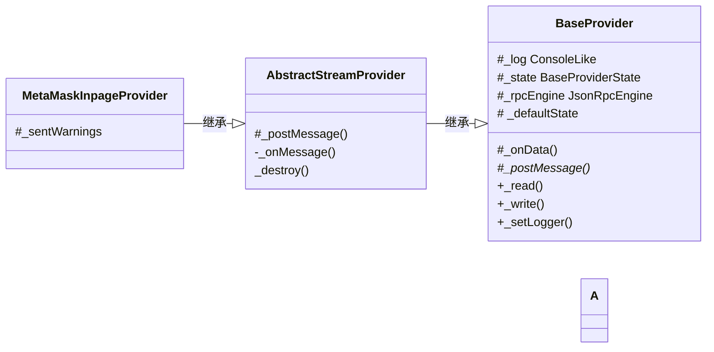

## UML

UML类图: `- Private`、`# Protected`、`* Abstract(渲染出来是斜体)`、`$ Static(渲染出来是下划线)`

```mermaid
classDiagram
direction RL
class BaseProvider {
  #_log ConsoleLike
  #_state BaseProviderState
  #_rpcEngine JsonRpcEngine
  # _defaultState
  #_onData()
  #_postMessage()*
  +_read()
  +_write()
  +_setLogger()
}
class AbstractStreamProvider {
  #_postMessage()
  -_onMessage()
  _destroy()
}

class MetaMaskInpageProvider {
  #_sentWarnings
}

class A

BaseProvider <|-- AbstractStreamProvider: 继承
AbstractStreamProvider <|-- MetaMaskInpageProvider: 继承
```
