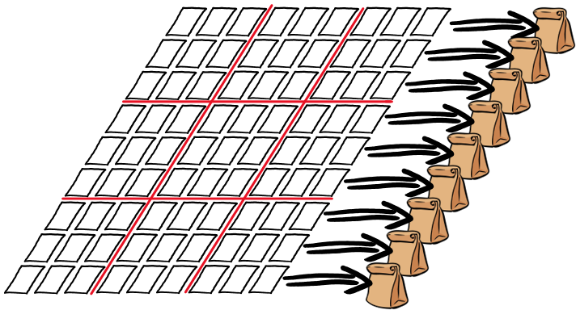

零知识证明的本质就是在**不揭晓我所知道或拥有的某样东西的前提**下，向别人证明我有很大几率（这点很重要，零知识证明说到底是一个概率上的证明）确实知道或拥有这个东西。

<!-- 零知识证明，它指的是证明者能够在不向验证者提供任何有用的信息的情况下，使验证者相信某个论断是正确的 -->

## 示例

### 示例一

一个典型的零知识证明示例是阿里巴巴和强盗的故事：

阿里巴巴知道打开藏着财宝的山洞的咒语。四十大盗抓住他，让他说出咒语。
如果阿里巴巴说出咒语，就会因为没有利用价值而被杀死。
如果阿里巴巴坚持不说，强盗不会相信他真的掌握咒语，也会杀死他。
但阿里巴巴想了一个好办法，他对强盗说：“你们离我一箭之地，用弓箭指着我，你们举起右手我就念咒语打开石门，
举起左手我就念咒语关上石门，如果我做不到或逃跑，你们就用弓箭射死我。”

### 示例二

小明出了一道非常难的数独题，小红花了很长时间尝试去解开这个数独，但是怎么都解不出结果。

小红觉得小明在耍她，小明回答道“我能证明给你看这题是有解的，而且我知道这个解”

小红暗自想着，“等你证明给我看之后，我就把解记下来”

小明接着说：“我会用零知识证明的方法给你证明我会这题的解。也就是说我**不会把解给你看，却能让你信服我确实有这题的解**。”

小明拿出81（9x9）张空白的卡片放在桌上，在每张纸上写上1-9中的一个数字，他让小红转过身闭上眼，然后把这81张卡片小心翼翼地按照解的排列放在桌上，代表谜底的卡片，数字面朝下放在桌上；代表谜面的卡片，则数字面朝上放在桌上。

小明放好卡片后，对小红说：“小红，你不能偷看这些面朝下的卡片。但是我能让你检验这些解：你可以随意选择按照行(row)，或者按照列(column)，或者按照3x3的九宫格(box) 来检验我的解。你挑一种吧”

小红告诉小明她决定选择按照**行的方法来验证**。小明接着把每一行的9张卡片收起来单独放到一个麻布袋里。所有卡片都被收完放在了9个麻布袋里。小明接着摇了摇每个麻布袋，把里面的卡片顺序都打散。最后把这9个麻布袋交给小红

“好了，你可以打开这些布袋了。“小明对小红说，“每个布袋里应该都有正好9张，没有重复数字的，分别是数字1-9的卡片。”

“可这啥都证明不了啊！我也可以这样做给你看。我只要保证每一行都是1-9这9张卡片，不去管纵列和九宫格里的数字是不是也都是没有重复的不就行了。“小红说道。

小明解释说：“可是我事先也不知道你会选按照行来收集卡片，还是按照列，还是按照九宫格啊。我是按照题解来放置卡片的，你选啥我都没在怕的”

故事里要证明的东西就是一个数独题的解，小明让小红每次随机抽取行，列，九宫格的卡片，并收集在一起随机打乱，小红通过拆开袋子并不能知道题解，但是却能相信小明很大几率确实知道题解。

## 零知识证明用处

- 数据的隐私保护:
  - 比如当年我的成绩单，我只想向人证明，我的成绩及格了，但是我不想让别人知道我到底考了61分还是62分，这会很尴尬。
  - 我没有心脏病，但是保险公司需要了解这一点，但是我不想让保险公司知道我的隐私信息
- 计算压缩与区块链扩容
  - 在众多的区块链扩容技术中，Vitalik 采用 zkSNARK 技术能够给现有的以太坊框架带来几十倍的性能提升。因为有了计算的证明，同样一个计算就没必要重复多次了，在传统的区块链架构中，同样的计算被重复多次，比如签名的校验，交易合法性校验，智能合约的执行等等。这些计算过程都可以被零知识证明技术进行压缩。
- 端到端的通讯加密
  - 用户之间可以互相发消息，但是不用担心服务器拿到所有的消息记录，同时消息也可以按照服务器的要求，出示相应的零知识证明，比如消息的来源、与发送的目的地。
- 身份认证：用户可以向网站证明，他拥有私钥，或者知道某个只要用户自己才知道的秘密答案，而网站并不需要知道，但是网站可以通过验证这个零知识证明， 从而确认用户的身份
- 去中心化存储：服务器可以向用户证明他们的数据被妥善保存，并且不泄露数据的任何内容。
- 信用记录：信用记录是另一个可以充分发挥零知识证明优势的领域，用户可以有选择性的向另一方出示自己的信用记录，一方面可以有选择的出示满足对方要求的记录分数，同时证明信用记录的真实性。
- 构造完全公平的线上数字化商品的交易协议。
- 更多的例子，可以是任何形式的数据共享，数据处理与数据传输。

## 性质

关于零知识证明，有三条主要的性质：

- 完备性。如果证明方和验证方都是诚实的，并遵循证明过程的每一步，进行正确的计算，那么这个证明一定是成功的，验证方一定能够接受证明方。
- 合理性。没有人能够假冒证明方，使这个证明成功。
- 零知识性。证明过程执行完之后，验证方只获得了“证明方拥有这个知识”这条信息，而没有获得关于这个知识本身的任何一点信息。

- 非交互的零知识证明: zk-SNARK(Zero-knowledge succinct non-interactive arguments of knowledge)

## 加密货币中的应用

匿名性极强的区块链加密货币ZCash
主打匿名性的区块链加密货币ZCash

了匿名 Coin，比如 Monero, 比如 ZCash

在区块链中，**用户需要将交易明文广播给所有矿工**，由他们来校验交易的合法性。

对于比特币的例子，一笔转帐交易合法与否，其实只要证明三件事：

- 发送的钱属于发送交易的人
- 发送者发送的金额等于接收者收到金额
- 发送者的钱确实被销毁了

整个证明过程中，矿工其实并不关心具体花掉了多少钱，发送者具体是谁，接受者具体是谁。矿工只关心系统的钱是不是守恒的。

zcash 就是用这个思路实现了隐私交易。

使用了zk-SNARK原理的ZCash公链做到了全部数据匿名如

- 交易发送者地址
- 交易接收者地址
- 交易的数值

## 参考

- [一个数独引发的惨案：零知识证明](https://zhuanlan.zhihu.com/p/34072069)
  - https://medium.com/qed-it/the-incredible-machine-4d1270d7363a
  - https://mirror.xyz/kuiqian.eth/IAYafcJ3znjSde23Qvg2V31P7X47hLXukleCqjCgHkU
- [借助阿里巴巴和强盗的故事，轻松理解加密货币的零知识证明](https://juejin.cn/post/6844904054242410509)
