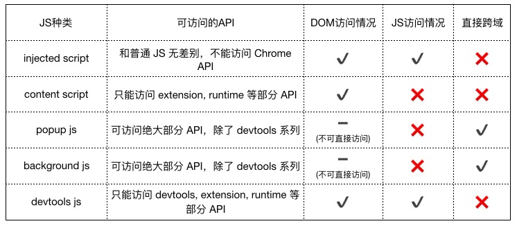
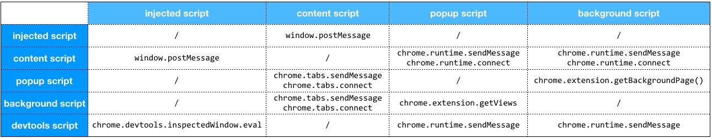

chrome插件可以扩展浏览器的功能，为用户提供更便捷的操作或增强网页的交互体验。

## 主要文件内容

- Manifest （清单文件）主要的插件配置清单，包含插件的名称、版本号、图标、脚本文件名称等
  - ⭐️ permissions 权限
- Content Script （内容脚本）
  - injected script，是插件**注入到页面的脚**本，但是不**会体现在页面 DOM** 结构里。
  - content script **可以操作 DOM**，但是它和页面其他的脚本是隔离的，**访问不到其他脚本**定义的变量、函数等，相当于运行在**单独的沙盒**里。
  - content script 可以**调用有限的 chrome 插件 API**，网络请求收到同源策略限制。
  - 调试可以在 chrome devtool 里的source 里面的 content script
- Background Script （后台脚本）
  - 可以调用**全部的 chrome 插件 API**，实现跨域请求、网页截屏、弹出 chrome 通知消息等功能。
  - 相当于在一个隐藏的浏览器页面内默默运行。(类似**独立的一个线程**)
- 功能页面(相当于多页应用)
  - 包括点击插件图标弹出的页面(简称 popup)popup.html popup.js...
  - 插件的配置页面(简称 options)
  - 浏览器新增tab默认页 (newtab)


## 各部分权限



> ps: injected script 可以理解为 源web页脚本

## 通信方式



> ps: injected script 可以理解为 源web页脚本

### content-script/popup与background

1.  `chrome.runtime.sendMessage` 和 `chrome.runtime.onMessage.addListener` 适用于**一次性发送和接收消息**

```js
// 发送方 (内容脚本或弹窗)
chrome.runtime.sendMessage({ greeting: "hello" }, (response) => {
  console.log("Response:", response);
});

// 接收方 (后台脚本)
chrome.runtime.onMessage.addListener((message, sender, sendResponse) => {
  console.log("Received message:", message);
  sendResponse({ farewell: "goodbye" });
  return true; // Return true to keep the message channel open for async response.
});
```

`chrome.tabs.sendMessage(tabId, message, options)` 允许向特定标签的内容脚本(content-script)发送消息
使用前需调用`chrome.tabs.query`获取 tabId 以指定那个特定的tab标签也发送消息

```js
chrome.tabs.query({active: true, currentWindow: true}, function(tabs) {
  // 发送到当前激活的标签页面
  chrome.tabs.sendMessage(tabs[0].id, {greeting: "hello"}, function(response) {
    console.log(response.farewell);
  });
});
```

2.  `chrome.runtime.connect` 和 `chrome.runtime.onConnect` 持久的双向通信通道，适用于需要持续交互的场景。

```js
// 发送方 (内容脚本)
const port = chrome.runtime.connect({ name: "content-channel" });
port.postMessage({ greeting: "hello" });
port.onMessage.addListener((response) => {
  console.log("Response:", response);
});

// 接收方 (后台脚本)
chrome.runtime.onConnect.addListener((port) => {
  console.log("Connected:", port.name);
  port.onMessage.addListener((message) => {
    console.log("Message received:", message);
    port.postMessage({ response: "hi from background" });
  });
});
```

`chrome.tabs.connect(tabId)`指定标签中的内容脚本(content-script)之间的连接
使用前需调用`chrome.tabs.query`获取 tabId 以指定那个特定的tab标签也发送消息

```js
browser.tabs.connect(
  tabId,      // 整数
  connectInfo // 可选的对象
)
```


### content-script 与 web页

1. `window.postMessage` 和 `window.addEventListener("message", ...)`

```js
// 网页脚本
window.addEventListener("message", (event) => {
  if (event.source !== window) return;
  if (event.data.type === "FROM_EXTENSION") {
    console.log("Message from extension:", event.data.payload);
    window.postMessage({ type: "TO_EXTENSION", payload: "Hello from page" }, "*");
  }
});

// 内容脚本
window.postMessage({ type: "FROM_EXTENSION", payload: "Hello from extension" }, "*");

window.addEventListener("message", (event) => {
  if (event.source !== window) return;
  if (event.data.type === "TO_EXTENSION") {
    console.log("Message from page:", event.data.payload);
  }
});
```

### 跨插件通信

除了本身chrome extension 还可以与其他extension通信

> **发送请求信息时，必须提供chrome插件的 ID**


1. 一次性通信 `chrome.runtime.sendMessage(id, message)` 和`chrome.runtime.onMessageExternal()`

```js
// 需要通信的extension id
const laserExtensionId = "abcdefghijklmnoabcdefhijklmnoabc";

chrome.runtime.sendMessage(laserExtensionId, {getTargetData: true},
  function(response) {
    if (targetInRange(response.targetData))
      chrome.runtime.sendMessage(laserExtensionId, {activateLasers: true});
  }
);

chrome.runtime.onMessageExternal.addListener(
  function(request, sender, sendResponse) {
    // 黑名单，不允许此扩展程序访问
    if (sender.id === blocklistedExtension)
      return;
    else if (request.getTargetData)
      sendResponse({targetData: targetData});
    else if (request.activateLasers) {
      var success = activateLasers();
      sendResponse({activateLasers: success});
   }
});
```

2. 长链接通信`chrome.runtime.connect(id)` 和 `chrome.runtime.onConnectExternal.addListener`

```js
// 需要通信的extension id
const laserExtensionId = "abcdefghijklmnoabcdefhijklmnoabc";

let port = chrome.runtime.connect(laserExtensionId);
port.postMessage(...);

chrome.runtime.onConnectExternal.addListener(function(port) {
  port.onMessage.addListener(function(msg) {
    //  ...
  });
});
```

###  web页直接与 background通信

> [!TIP]
> 注意: manifest配置 需 externally_connectable.matches！！这个很重要 只有配置了该值 才能在web页直接访问到 `chrome.runtime`

如果未指定`externally_connectable`健，则默认所有chrome extension都可以链接，但网页无法直接连接，
当指定externally_connectable，如果未指定 `externally_connectable.ids: ["*"]` 则其他扩展将失去对你的扩展的连接，这可能会导致意想不到的结果 需注意。

- `externally_connectable.ids`指定允许其他扩展连接你的扩展的id
- `externally_connectable.matches`: 指定允许直接连接 你的扩展的的url

> 扩展即是chrome extension


web页直接与插件通信 需指定插件id 与 跨插件通信差不多

```js
chrome.runtime.sendMessage(editorExtensionId, {openUrlInEditor: url},
  function(response) {
    if (!response.success) handleError(url);
  }
);
```

## storage

[官方文档](https://developer.chrome.com/docs/extensions/reference/api/storage)

> [!TIP]
> 美观点观察chrome的storage可使用该插件: [Storage Area Explorer](https://chromewebstore.google.com/detail/storage-area-explorer/ocfjjjjhkpapocigimmppepjgfdecjkb)

storage存储区:

- `storage.local`: 数据存储在本地，并在删除扩展时清除
- `storage.sync`: 以利用 Chrome 的同步功能，**实现同一账户下的扩展程序数据在多个设备之间同步**
  - 如果已登录账户的 Chrome 离线时，希望同步存储的数据会先进行本地存储，等待浏览器上线后再进行同步。
  - 如果用户在 Chrome 设置中取消了数据同步功能，那么 chrome.storage.sync 相关方法的作用和 chrome.storage.local 一样
- `storage.session`: 在浏览器会话期间将数据保存在内存中
- `storage.managed`: 只读存储，策略类似于选项，但由系统管理员而不是用户配置，允许为组织的所有用户预先配置扩展


## 参考

- https://juejin.cn/post/6998864120611094564
- https://juejin.cn/post/6844903985711677453
