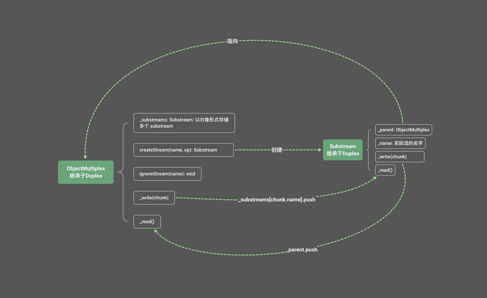

[@metamask/object-multiplex](https://github.com/MetaMask/object-multiplex) 是 MetaMask 提供的一个基于`objectMode`的流多路复用库.

用于将**多条流整合到同一个流中处理**，在**同一个流中同时处理多种不同类型的数据通道**（即多路复用）。

`ObjectMultiplex`继承于[readable-stream](https://github.com/nodejs/readable-stream)[^1]的`Duplex`


## 对比

使用`ObjectMultiplex` 多个流同时经过一个处理流

不使用`ObjectMultiplex`时:


```js
const streamA = new Duplex(...)
const streamB = new Duplex(...)
const transformStream = new Transform(...)

// 此时需分别添加transformStream
streamA.pipe(transformStream).pipe(streamA)
streamB.pipe(transformStream).pipe(streamB)
```

使用`ObjectMultiplex`时, 注意transformStream需开启objectMode(因为ObjectMultiplex使用对象形式传输数据)

```js
import { Transform } from 'readable-stream';
import { ObjectMultiplex } from '@metamask/object-multiplex';

const mux = new ObjectMultiplex();
const streamA = mux.createStream('streamA');
const streamB = mux.createStream('streamB');
const transformStream = new Transform({
  // !! 注意必须objectMode: true, object-multiplex内部是使用对象形式传输的
  objectMode: true,
  transform(chunk, encoding, callback) {
    console.log('transform: ', chunk);
    this.push(chunk);
    callback();
  },
});

// 此时只需直接往mux父流 添加 transformStream
mux.pipe(transformStream).pipe(mux);

streamA.write('streamA test');
streamB.write('streamB test');

// 此时transformStream 接收到数据 为
// transform:  {
//   name: "streamA",
//   data: "streamA test",
// }
// transform:  {
//   name: "streamB",
//   data: "streamB test",
// }
```

## 头尾同一流的意义

metamask出现很多头尾同一流

```js
mux.pipe(streamA).pipe(mux)
```

- mux.pipe(streamA): 将 mux 的输出（分发后的数据）发送到 streamA
- streamA.pipe(mux): 将 streamA 的输入（通道的数据）发送回 mux, 让 mux 收集并分发。

mux 需要从 streamA 中收集数据，同时将数据发送给 streamA。这构成了一个完整的循环

实现了双向通信: 需要既发送又接收数据，形成完整的通信链路

### 双向通信

streamA流和transformStream流可以相互通信

```js
import { Transform } from 'readable-stream';
import { ObjectMultiplex } from '@metamask/object-multiplex';

const mux = new ObjectMultiplex();
const streamA = mux.createStream('streamA');
const transformStream = new Transform({
  // !! 注意必须objectMode: true, object-multiplex内部是使用对象形式传输的
  objectMode: true,
  transform(chunk, encoding, callback) {
    console.log('transform: ', chunk);
    this.push(chunk);
    callback();
  },
});

// 此时只需直接往mux父流 添加 transformStream
mux.pipe(transformStream).pipe(mux);

```

streamA 或mux 写入数据 传给 transform流

```js
// mux.pipe(transformStream).pipe(mux)
streamA.write('streamA test');
// 结果:
// transform:  {
//   name: "streamA",
//   data: "streamA test",
// }
```

数据流向大概是:

1. streamA的`_write`触发, 内部调用`this._parent.push`(即是mux的push函数)
2. mux的_read触发
3. 因pipe连接mux的可读流数据 触发transformStream的transform, transform内触发this.push
4. 因pipe连接transformStream的可读流数据 触发mux的_write
5. mux的_write 即而触发 streamA的 _read


```js
// 此时需改成以streamA 连接，因为mux.write是往streamA的可读流添加数据
streamA.pipe(transformStream).pipe(streamA);
mux.write({
  name: 'streamA',
  data: 'mux stream call streamA'
})
// 结果:
// transform:  mux stream call streamA
```

数据流向大概是:

1. mux的`_write`触发， 内部substreams['streamA'] 触发streamA的push函数
2. streamA的_read触发
3. 因pipe连接streamA的可读流数据 触发transformStream的transform, transform内触发this.push
4. 因pipe连接transformStream的可读流数据 触发streamA的_write
5. streamA的_write 即而触发streamA的`_parent`(即是mux)的push函数,  即而触发 mux的 _read


transform流 写入数据 传给 streamA

```js
// mux.pipe(transformStream).pipe(mux)

transformStream.write({
  name:'streamA',
  data: 'transformStream test'
});
// 注意这里 不能使用mux.on('data', ...)
// ObjectMultiplex 内部实现 mux 是parent流 不存储任何数据
// 所有数据都是由各子的子流substream 中存储
// 所以这里如果 mux.on('data', ...) 是永远都不会触发的
streamA.on('data', (data) => {
  console.log('streamA data event:', data);
});

// 结果:
// transform:  {
//   name: "streamA",
//   data: "transformStream test",
// }
// streamA data event: transformStream test
```

数据流向大概是:

1. transformStream的transform触发，transform内触发this.push
2. 因pipe连接mux流，transformStream的可读流数据 触发mux流的_write
3. mux流的write触发 内部substreams['streamA'] 触发streamA的push函数
4. 继而 streamA的_read触发


## 源码




[^1]: readable-stream是Node.js官方出的库,旨在提供Streams模块的兼容性实现。允许开发者在不同的Node.js版本中使用一致的`StreamsAPI`，同时也为浏览器环境提供支持
