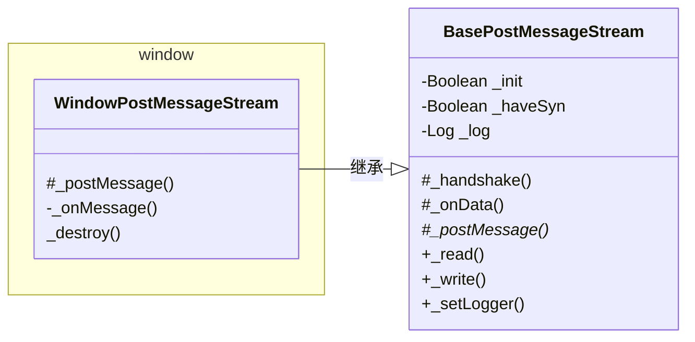

[@metamask/post-message-stream](https://github.com/MetaMask/post-message-stream) 是MetaMask提供的一个在`window.postMessage`实现的双工对象流(基于 Duplex 的objectMode)

该库起初仅支持 `window.postMessage`的环境, 后续该库扩展环境范围:

- window.postMessage: `window.postMessage` 和 `window.addEventListener('message',...)`
- runtime: 浏览器插件中的 `chrome.runtime.sendMessage`和`chrome.runtime.onMessage.addListener`
- webWorker:
  - web端的`WebWorkerParentPostMessageStream`: `worker.postMessage`和`worker.onmessage`
  - worker端的`WebWorkerPostMessageStream`: `self.postMessage` `self.addEventListener('message', ...)`
- node-process:
  - 父进程`ProcessParentMessageStream`: `process.send`和`process.on('message', ...)`
  - 子进程`ProcessMessageStream`: `globalThis.process.send`和`globalThis.process.on('message', ...)`
- node-thread:
  - 父线程 `ThreadParentMessageStream`: `worker.postMessage` 和 `worker.on('message', ...)`
  - 子线程`ThreadMessageStream`: `parentPort.postMessage` 和 `parentPort.on('message', ...)`

## 对比

未使用该库之前

```js
window.addEventListener('message', function (e){
  if (e.data.target === 'nameA') {
    console.log(e.data)
  }
})

window.postMessage({
  name: 'nameB',
  target: 'nameA'
})
```

使用

```js
import { WindowPostMessageStream } from '@metamask/post-message-stream';

const streamA = new WindowPostMessageStream({
  name: 'streamA',
  target: 'streamB',
});

// postMessage
streamA.write('hello');

const streamB = new WindowPostMessageStream({
  name: 'streamB',
  target: 'streamA',
});

// on message
streamB.on('data', data => {
  console.log(data)
})

```

## 源码

UML类图: `- Private`、`# Protected`、`* Abstract(渲染出来是斜体)`、`$ Static(渲染出来是下划线)`



`ProcessMessageStream`,`ProcessParentMessageStream`
`ThreadMessageStream`, `ThreadParentMessageStream`
`BrowserRuntimePostMessageStream`
`WebWorkerPostMessageStream`, `WebWorkerParentPostMessageStream`
与WindowPostMessageStream成员类似

其中基类`BasePostMessageStream`继承于[readable-stream](https://github.com/nodejs/readable-stream)[^1]的`Duplex`


[^1]: readable-stream是Node.js官方出的库,旨在提供Streams模块的兼容性实现。允许开发者在不同的Node.js版本中使用一致的`StreamsAPI`，同时也为浏览器环境提供支持
