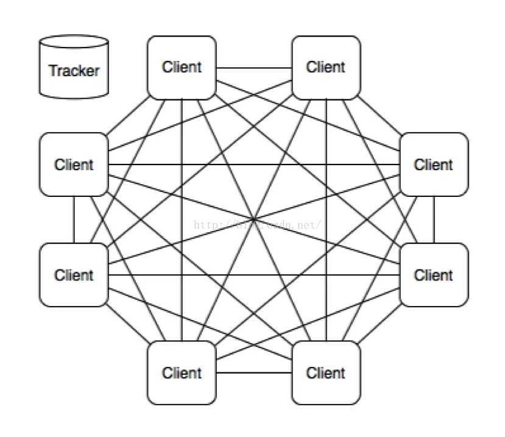

torrent文件即我们常说的种子文件，是由[BitTorrent协议](https://zh.wikipedia.org/wiki/BitTorrent_(%E5%8D%8F%E8%AE%AE))所定义的。

torrent文件本质就是文本文件，包含 tracker信息和文件信息两部分

- tracker信息: 记录的是 BT服务器/Tracker服务器/追踪服务器 相关信息
- 文件信息: 记录该torrent中的目标文件相关信息

如果直接用vscode打开torrent文件是一堆乱码的，因为torrent使用了一种特殊的编码Bencode

## Bencode

[Bencode](https://zh.wikipedia.org/wiki/Bencode)是 BitTorrent协议中用于存储和传输松散结构数据的编码方式

Bencode支持四种不同类型的值

- byte strings  字节串
- integers  整数
- lists  列表
- dictionaries  字典


### 动手做demo

> 使用 [node-bencode](https://github.com/webtorrent/node-bencode)库

使用bencode编码

```js
import bencode from 'bencode'

const data = {
  string: 'Hello World',
  integer: 12345,
  dict: {
    key: 'This is a string within a dictionary'
  },
  list: [ 1, 2, 3, 4, 'string', 5, {} ]
}

const result = bencode.encode(data)
console.log(Buffer.from(result).toString())
// d4:dictd3:key36:This is a string within a dictionarye7:integeri12345e4:listli1ei2ei3ei4e6:stringi5edee6:string11:Hello Worlde
```

使用bencode解码

```js
import bencode from 'bencode'

const data = 'd4:dictd3:key36:This is a string within a dictionarye7:integeri12345e4:listli1ei2ei3ei4e6:stringi5edee6:string11:Hello Worlde'
const result = bencode.decode(Buffer.from(data))
console.log(result)

const resultUtf8 = bencode.decode(Buffer.from(data), 'utf8')
console.log(resultUtf8)

// {
//   dict: {
//     key: Uint8Array(36) [ 84, 104, 105, 115, 32, 105, 115, 32, 97, 32, 115, 116, 114, 105, 110, 103, 32, 119, 105, 116, 104, 105, 110, 32, 97, 32, 100, 105, 99, 116, 105, 111, 110, 97, 114, 121 ],
//   },
//   integer: 12345,
//   list: [ 1, 2, 3, 4, Uint8Array(6) [ 115, 116, 114, 105, 110, 103 ], 5, {} ],
//   string: Uint8Array(11) [ 72, 101, 108, 108, 111, 32, 87, 111, 114, 108, 100 ],
// }
// {
//   dict: {
//     key: "This is a string within a dictionary",
//   },
//   integer: 12345,
//   list: [ 1, 2, 3, 4, "string", 5, {} ],
//   string: "Hello World",
// }
```

### 分析编码内容

让我们来看看编码出来的内容

```txt
d4:dictd3:key36:This is a string within a dictionarye7:integeri12345e4:listli1ei2ei3ei4e6:stringi5edee6:string11:Hello Worlde
```

Bencode编码算法中

- integers整数类型 编码为`i<base10 integer>e`
   - 上面`i12345e` 对应了 `integer: 12345`中的12345
     - 格式化下: `i 12345 e`
- byte strings字节串类型 编码为`<length>:<contents>`
   - 上面`7:integer` 对应了 `integer: 12345`中的integer
     - 格式化下: `7: integer`
- dictionaries字典类型 编码为 `d<pairs>e`
   - 上面`de`对应`{}`
   - 上面 `d3:key36:This is a string within a dictionarye` 对应`{key: "This is a string within a dictionary"}`
     - 格式化下: `d 3:key 36:This is a string within a dictionary e`其中两个字符串类型 `3:key`和 `36:This is a string within a dictionary`
- lists列表类型 编码为`l<elements>e`
   - 上面`li1ei2ei3ei4e6:stringi5edee` 对应`[ 1, 2, 3, 4, "string", 5, {} ]`
     - 格式化下: `l i1e i2e i3e i4e 6:string i5e de e`

## torrent文件内容

从上面可知 torrent文件需要使用bencode编码去解码才能解析出文件内容

下面我们使用[node-bencode](https://github.com/webtorrent/node-bencode)来解析一个torrent文件，来看看里面的具体内容

```js
import fs from 'fs'
import bencode from 'bencode'

fs.readFile('./test.torrent', (err, data) => {
  const result = bencode.decode(data, 'utf8')
  console.log(JSON.stringify(result, null, 2))
})

// 输出结果

// {
//   "announce-list": [
//     [
//       "http://p4p.arenabg.com:1337/announce"
//     ],
//     [
//       "udp://47.ip-51-68-199.eu:6969/announce"
//     ],
//     ...
//   ],
//   "info": {
//     "files": [
//       { "length": 601, "path": ["Code.txt"] },
//       { "length": 50, "path": ["SeeHD.WS.txt"] },
//       { "length": 38, "path": ["Torrent Downloaded From ProstyleX.com.txt" ] },
//       { "length": 3135215904, "path": ["WwW.SeeHD.PL__Overlord 2018 1080p PROPER WEB-DL X264 5.1-SeeHD.mkv"] }
//     ],
//     "name": "Overlord 2018 1080p PROPER WEB-DL X264 5.1-SeeHD",
//     "piece length": 262144,
//     "pieces": <binary SHA1 hashes> // "xxx一些乱码"
//   }
// }
```

上面输出的结果中

- announce-list的内容 就是对应的文章开头说的 tracker信息
- info的内容 对应的就是 文件信息

一般种子文件可能的字段和其含义:

- tracker信息
  - announce: 追踪服务器的URL
  - announce-list: BitTorrent规范中的[BEP-0012](http://www.bittorrent.org/beps/bep_0012.html)扩展支持多个追踪器
- 文件信息
  - `info.name`: 建议保存文件的目录名称
  - `info.files`: 种子中的文件， 每个元素代表一个目录名或文件名。
  - `info["piece length"]`: 每个片段/文件块的长度
  - `info.pieces`： 实际每个文件块的SHA-1 所集成的Hash
    - 可以抽象的想象一些 `info.pieces`大概内容(ps: `Piece 1:`是不存在的):
      ```txt
        Piece 1: a1b2c3d4e5f6a7b8c9d0e1f2a3b4c5d6e7f8g9h0
        Piece 2: f1e2d3c4b5a6f7e8d9c0b1a2f3e4d5c6b7a8c9d0
        ...
      ```
    - pieces 字段的作用是**用于文件完整性校验**，确保下载过程中传输的数据块没有被篡改或损坏

### info_hash

info_hash 是**种子文件的唯一标识符**，它是 `.torrent` 文件中 info 部分的哈希值

从torrent获取info_hash, 对 info 部分进行 Bencode 编码后计算 SHA-1 哈希值，得到 info_hash。

```js
// 伪代码
info_hash = sha1(bencode.encode({
  info: {
    files: [
        { length: 615,    path: ["free audiobook verison.txt"] },
        { length: 393417, path: ["Warcraft_ Official Movie Novelization by Christie Golden.epub"] }
    ],
    name: "Warcraft_ Official Movie Novelization by Christie Golden EPUB",
    "piece length": 10485765,
    pieces: xxx
  }
}))
```

## Tracker服务器

Tracker服务器是**帮助BitTorrent协议在 节点与节点之间 做连接**的服务器(这里的节点指的用户与用户间)

> [!TIP]
> P2P最终的文件资源还是存储在用户，不存在一个中心化的服务器去存储资源!!  
> 资源下载发生在用户与用户之间



Bt下载器(迅雷之类的软件)一开始就要连接到Tracker，从Tracker获得其他用户的客户端IP地址(Peers)后，才能连接到其他客户端下载。
在传输过程中，也会一直与Tracker通信，上传自己的信息，获取其它客户端的信息。

举个栗子

例如BT服务器将一个文件分成了N个部分，有甲、乙、丙、丁四位用户同时下载，那么BT并不会完全从服务器下载这个文件的所有部分，而是根据实际情况有选择地从其他用户的机器中下载已下载完成的部分。

例如甲已经下载了第1部分，乙已经下载了第2部分，那么丙就会从甲的机器中下载第1部分，从乙的机器中下载第2部分，当然甲、乙、丁三位用户也在同时从丙的机器中下载相应的部分，这就大大减轻了BT服务器的负荷，也同时加快了丙的下载速度，也就是说每台参加下载的计算机既从其他用户的计算机上下载文件，同时自身也向其他用户提供下载，因此参与**下载的用户数量越多，下载速度也越高**。

这里有个问题 用户与用户之间怎么知道对方有哪部分文件和对方的ip地址呢，这就是Tracker起到的作用

<!-- 在 P2P 下载中，数据从多个节点分块下载，可能会因为传输错误、恶意节点等原因导致数据损坏。

下载完成后，客户端会对每个块重新计算 SHA-1 哈希值，并与`pieces` 字段中对应的哈希值进行比较：
- 如果匹配，则数据块完整。
- 如果不匹配，则丢弃损坏的数据块并重新下载。 -->

## DHT分布式哈希表

如果Tracker服务不工作或者封禁了怎么办？

DHT 网络（Distributed Hash Table分布式哈希表）是 BitTorrent 协议的一种去中心化技术，它允许在没有 Tracker 服务器的情况下，客户端通过 P2P 网络找到其他下载节点（Peers）

> DHT 可以与 .torrent 文件或 磁力链接(Magnet Link)一起工作，适应多种场景

支持DHT的客户端(即迅雷，电驴这些客户端)可以在 Tracker不可用时通过 DHT网络查找 Peer(用户的节点)

> ps: 前提是需要客户端(即迅雷，电驴这些客户端)支持


大概原理

-  加入DHT网络(可能就是打开软件时)
   - 客户端成为DHT网络中的一个节点
   - 每个 DHT 节点都维护一部分哈希表，用于存储种子信息（info_hash）和与之相关的 Peer 信息
- 存储和查询数据
   - 存储：当客户端拥有一个种子（或下载一部分文件）时，它会将自己的地址（IP 和端口）与种子的 info_hash 绑定，并**通过DHT协议广播到网络**。
   - 查询：当客户端需要下载文件时，它会将种子的 info_hash 发送到 DHT 网络，寻找拥有该种子的 Peer 列表。

> 所以当没有Tracker服务时，靠把info_hash 广播到DHT网络中 找到对应的 Peer节点(即别的用户的电脑) 去下载，代替了原本Tracker的功能

## 大概的下载流程

1. 解析 .torrent 文件
2. 与tracker服务建立链接，发送请求以获取 Peers 列表(这个列表就是其他client的节点ip和端口)
3. 请求Peers, 下载 Piece(文件片段)，根据 pieces 字段校验 Piece 的有效性
4. 组装 Piece片段，得到完整的文件

## 参考

- [Torrent_file维基](https://zh.wikipedia.org/zh-cn/%E7%A7%8D%E5%AD%90%E6%96%87%E4%BB%B6)/[Torrent_file维基(en版更详细)](https://en.wikipedia.org/wiki/Torrent_file#Examples)
- [Bencode维基](https://zh.wikipedia.org/wiki/Bencode)
- [Tracker维基](https://zh.wikipedia.org/wiki/BitTorrent_tracker)
- [DHT分布式表](https://zh.wikipedia.org/wiki/%E5%88%86%E6%95%A3%E5%BC%8F%E9%9B%9C%E6%B9%8A%E8%A1%A8)
- [node-bencode库](https://github.com/webtorrent/node-bencode)
- ⭐️[tinyTorrent: 从头写一个 Deno 的 BitTorrent 下载器](https://cjting.me/2020/10/31/tinytorrent-a-deno-bt-downloader/)
- https://blog.csdn.net/qq_29757283/article/details/94450980
- ⭐️[一文读懂Bt种子、磁力链接、直链、p2p这些下载的区别](https://zhuanlan.zhihu.com/p/551337128)


<!-- BitTorrent的P2P下载是怎么做到的？
要做到P2P下载首先需要解决如下两个问题：

1、 如何知道哪些Client在下载同一个文件？

2、 对某一个文件，如何做到同时从多个来源进行下载？

对于第一个问题的解决方案：

设计一个TrackerServer（跟踪服务器），每一个Client需要去这里上报自己正在下载的文件以及自己的ip地址和监听的端口。新来的Client先要连接到TrackerServer，根据要下载的文件查询当前正在下载这个文件的Clients (Peers)。

对于第二个问题的解决方法：

Client从TrackerServer获取Peers后，分别向他们发起连接并询问当前的下载进度，然后，同时连接多个Peers分别下载他们已完成的文件片段，最后拼接出完整的文件。
 -->


<!--
1、那么我使用迅雷我也是一个peer,被迫给别的下载的peer传输资源？
  - 这要看迅雷的实现，下载和上传的逻辑由客户端控制。比如 tinyTorrent 就只下载不上传。可以使用一些 BT 软件比如 uTorrent。
2、如何把我本地一个资源做成种子呢？制作成功了，发给别人我电脑关机了或者资源删除了，意思就别人无法下载了吗？
  - 如果只有你一个人做种，那么是的，你下线了自然就无法下载了。
-->


<!--
要做到P2P下载首先需要解决如下两个问题：

1、 如何知道哪些Client在下载同一个文件？
2、 对某一个文件，如何做到同时从多个来源进行下载？
对于第一个问题的解决方案：
设计一个TrackerServer（跟踪服务器），每一个Client需要去这里上报自己正在下载的文件以及自己的ip地址和监听的端口。新来的Client先要连接到TrackerServer，根据要下载的文件查询当前正在下载这个文件的Clients (Peers)。
对于第二个问题的解决方法：
Client从TrackerServer获取Peers后，分别向他们发起连接并询问当前的下载进度，然后，同时连接多个Peers分别下载他们已完成的文件片段，最后拼接出完整的文件。
-->
